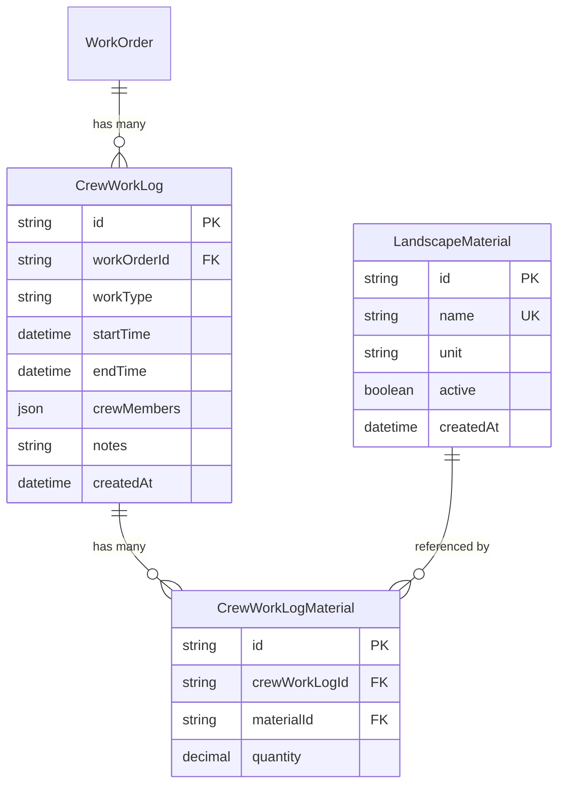

## Summary

Add a mobile-first "Log Work" form for landscaping crew to log field entries against existing work orders. Crew selects an open WO, records start/end time, crew members, materials from a fixed settings list, work type, and notes. Includes a materials settings page for admin management. Follows the same architecture as the snow form system.

---

## Problem Frame

Crew leads have no quick way to log work from the field. The existing WorkOrderForm is manager-oriented and desktop-heavy. Crew needs a fast, phone-friendly form to capture what they did on a job in under 60 seconds. (see origin: `docs/brainstorms/2026-07-01-landscaping-crew-form-requirements.md`)

---

## Requirements

| ID | Requirement | Origin |
|----|-------------|--------|
| R1 | Mobile-first "Log Work" form accessible from sidebar for all roles | R1 |
| R2 | Form fields: WO selector, start/end time, crew, work type, materials, notes | R2 |
| R3 | Start/end time with datetime-local + "Now" quick-fill | R3 |
| R4 | Crew member chips with auto-select for logged-in user | R4 |
| R5 | Materials from admin-managed fixed list with quantity input | R5 |
| R6 | Work type from JobCategory enum | R6 |
| R7 | Save creates CrewWorkLog + associated material entries linked to WO | R7 |
| R8 | Success state with "Log Another" (crew selection sticky) | R8 |
| R9 | Materials settings page (admin/manager only) | R9 |
| R10 | Existing WorkOrderForm unchanged | R10 |

---

## Key Technical Decisions

**KTD-1: New CrewWorkLog model rather than reusing existing CrewDetail/TimeEntry.**
The existing models serve the detailed manager WO form with per-employee hour breakdowns (job/setup/travel/unload/delivery). The crew log captures a simpler shape — one entry per visit with start/end time, crew list as JSON array, and work type. A separate model keeps crew logs independent and avoids complicating the existing WO form's data layer.

**KTD-2: Materials as a settings-managed fixed list (LandscapeMaterial model).**
Matches the snow pattern where SnowSite is a settings-managed list. Admin adds/deactivates materials. Crew picks from active materials and enters quantity. Material entries stored in a join model (CrewWorkLogMaterial) with materialId + quantity.

**KTD-3: Crew members stored as JSON string array on CrewWorkLog.**
Same pattern as SnowSiteService.crewMembers — stores employee names as a JSON array rather than a join table. Simple, sufficient for display, and avoids a many-to-many join for a lightweight log entry.

**KTD-4: WO dropdown shows DRAFT + IN_PROGRESS orders with customer name.**
Query filters `status IN (DRAFT, IN_PROGRESS)`, ordered by customer name, displaying `{customer.name} - {woNumber} ({jobType})` for identification.

---

## High-Level Technical Design

---

## Scope Boundaries

### In scope
- New Prisma models: CrewWorkLog, CrewWorkLogMaterial, LandscapeMaterial
- API routes for crew log creation and material settings CRUD
- "Log Work" form page + client component
- Materials settings page
- Sidebar nav entries

### Deferred to Follow-Up Work
- Reporting or summaries of crew logs
- Rolling up crew logs into WO cost totals
- Photo attachment on crew logs
- Editing or deleting submitted crew logs

### Outside this scope
- Changes to the existing WorkOrderForm
- Snow form system changes
- Invoicing or payment features

---

## Implementation Units

### U1. Prisma Models and Migration

**Goal:** Add the three new models to the schema and create a migration.

**Requirements:** R5, R7

**Dependencies:** None

**Files:**
- Modify: `prisma/schema.prisma`
- Create: `prisma/migrations/<timestamp>_add_crew_work_log/migration.sql`

**Approach:** Add CrewWorkLog (linked to WorkOrder), CrewWorkLogMaterial (join between log and material), and LandscapeMaterial (settings list). CrewWorkLog stores crewMembers as a Json field. Use the same naming conventions as existing models (snake_case table names via `@@map`). Create migration SQL manually and apply with `prisma migrate deploy` to both local and production DBs.

**Patterns to follow:** SnowSite/SnowSiteService models in `prisma/schema.prisma` for naming and field conventions.

**Test expectation:** none — pure schema/migration, verified by successful `prisma generate` and `prisma migrate deploy`.

**Verification:** `npx prisma generate` succeeds. Migration applies cleanly to both databases.

---

### U2. Zod Schemas

**Goal:** Add validation schemas for crew work log creation and material settings.

**Requirements:** R2, R7, R9

**Dependencies:** U1

**Files:**
- Modify: `src/lib/schemas.ts`

**Approach:** Add `crewWorkLogSchema` (workOrderId, workType, startTime, endTime, crewMembers array, materials array of {materialId, quantity}, notes) and `landscapeMaterialSchema` (name, unit). Follow the existing pattern of Zod schemas in this file.

**Patterns to follow:** `snowSiteServiceSchema` and `snowSiteSchema` in `src/lib/schemas.ts`.

**Test scenarios:**
- Happy path: valid crew log payload with all required fields parses successfully
- Edge case: empty crewMembers array fails validation (min 1 required)
- Edge case: missing workOrderId fails validation
- Edge case: materials array with zero quantity is allowed (crew may not use materials)

**Verification:** Schemas export correctly, used by API routes in U3.

---

### U3. API Routes

**Goal:** Create API endpoints for crew work log submission and materials settings management.

**Requirements:** R7, R9

**Dependencies:** U1, U2

**Files:**
- Create: `src/app/api/landscape/logs/route.ts`
- Create: `src/app/api/landscape/materials/route.ts`
- Create: `src/app/api/landscape/materials/[id]/route.ts`

**Approach:**
- `POST /api/landscape/logs` — requireAuth(), validate with Zod, verify workOrderId exists and is DRAFT/IN_PROGRESS, create CrewWorkLog + CrewWorkLogMaterial entries in a transaction. Return 201.
- `GET /api/landscape/materials` — requireAuth(), return active materials (or all if `?all=true` for settings). Ordered by name.
- `POST /api/landscape/materials` — requireAuth(ADMIN, MANAGER), validate name+unit, check for duplicate name, create.
- `PUT /api/landscape/materials/[id]` — requireAuth(ADMIN, MANAGER), update name/unit or toggle active.

**Patterns to follow:** `src/app/api/snow/services/route.ts` for the log POST pattern, `src/app/api/snow/sites/route.ts` for the settings CRUD pattern.

**Test scenarios:**
- Happy path: POST log with valid WO, crew, materials returns 201 and creates records
- Happy path: GET materials returns active materials sorted by name
- Happy path: POST material creates new entry, returns 201
- Error path: POST log with non-existent workOrderId returns 404
- Error path: POST log with COMPLETED/CANCELLED WO returns 400 ("Work order is not open")
- Error path: POST log without auth returns 401
- Error path: POST material without admin/manager role returns 403
- Error path: POST material with duplicate name returns 409
- Edge case: POST log with empty materials array succeeds (materials optional)

**Verification:** All endpoints respond correctly via curl or form submission. Auth gates enforced.

---

### U4. Log Work Form Component

**Goal:** Build the mobile-first client form for logging crew work.

**Requirements:** R1, R2, R3, R4, R5, R6, R8

**Dependencies:** U3

**Files:**
- Create: `src/components/portal/landscape-form/CrewWorkLogForm.tsx`
- Create: `src/components/portal/landscape-form/index.ts`

**Approach:** Follow the SiteVisitForm pattern exactly:
- useState for all form fields
- WO selector: MobileSelect with open WOs showing `{customer} - {woNumber} ({jobType})`
- Work type: MobileSelect populated from JobCategory enum values
- Time: datetime-local inputs with NowBtn quick-fill, initialized to current time
- Crew: tappable chips in a 2-column grid, auto-select current user
- Materials: for each active material from settings, show a row with the material name and a quantity MobileInput (number, inputMode decimal). Only materials with qty > 0 are submitted
- Notes: Textarea for general notes
- Fixed bottom save bar with Save button
- Success state: CheckCircle + "Logged!" + "Log Another" button that resets form but keeps crew sticky

**Patterns to follow:** `src/components/portal/snow-form/SiteVisitForm.tsx` for form structure, state management, submit flow, success state, and reset behavior.

**Test scenarios:**
- Happy path: fill all fields, submit, see success state with "Logged!" message
- Happy path: click "Log Another", form resets but crew selection persists
- Edge case: submit without selecting a WO shows "Please select a work order" error
- Edge case: submit with no crew members shows validation error
- Edge case: submit with no materials succeeds (materials are optional)
- Integration: form submission creates CrewWorkLog via POST to `/api/landscape/logs`

**Verification:** Form renders on mobile viewport, all interactions work, submit creates correct database records.

---

### U5. Log Work Page

**Goal:** Create the server component page that loads data and renders the form.

**Requirements:** R1, R4, R6

**Dependencies:** U4

**Files:**
- Create: `src/app/portal/landscape/log/page.tsx`

**Approach:** Server component that:
1. Checks auth via `auth()`, redirects to /login if not authenticated
2. Parallel-fetches: open work orders (DRAFT/IN_PROGRESS with customer name), active materials, active employees
3. Renders `CrewWorkLogForm` with the fetched data and current user name
4. Same layout wrapper as snow log page: `max-w-lg mx-auto pb-24 sm:pb-6`

**Patterns to follow:** `src/app/portal/snow/log/page.tsx` for server component structure.

**Test scenarios:**
- Happy path: authenticated user sees the form with populated WO dropdown, materials, and employees
- Error path: unauthenticated user redirected to /login

**Verification:** Page loads at `/portal/landscape/log` with correct data.

---

### U6. Materials Settings Page

**Goal:** Create the admin-only settings page for managing the fixed materials list.

**Requirements:** R9

**Dependencies:** U3

**Files:**
- Create: `src/app/portal/landscape/settings/page.tsx`
- Create: `src/components/portal/landscape-form/MaterialSettings.tsx`

**Approach:** Follow the SnowSettings SiteListSection pattern:
- Server component page checks auth + admin/manager role
- Client component with add form (name + unit inputs + Add button), scrollable list with activate/deactivate toggle
- Each material shows name and unit (e.g., "Mulch - yards")
- Fetch all materials (including inactive) via `?all=true`

**Patterns to follow:** `src/components/portal/snow-form/SnowSettings.tsx` SiteListSection for the CRUD list pattern, `src/app/portal/snow/settings/page.tsx` for the settings page structure.

**Test scenarios:**
- Happy path: admin sees full material list, can add new material with name + unit
- Happy path: deactivate a material, it appears dimmed with "Activate" button
- Error path: non-admin user sees 403 or redirect
- Error path: adding a duplicate material name shows error message
- Edge case: empty state shows "No materials yet" message

**Verification:** Settings page at `/portal/landscape/settings` shows material management UI. Changes persist across page reloads.

---

### U7. Sidebar Navigation

**Goal:** Add "Log Work" and "Landscape Settings" entries to the portal sidebar.

**Requirements:** R1, R9

**Dependencies:** U5, U6

**Files:**
- Modify: `src/components/portal/PortalShell.tsx`

**Approach:** Add a new "Landscaping" nav section (or modify the existing one) with:
- `{ href: "/portal/landscape/log", label: "Log Work", icon: ClipboardPlus }` — visible to all roles
- `{ href: "/portal/landscape/settings", label: "Landscape Settings", icon: Settings, adminOnly: true }` — admin/manager only

Use the existing `NavSection` structure and per-item `adminOnly` check already in place.

**Patterns to follow:** Snow Removal section in `src/components/portal/PortalShell.tsx` for section structure and adminOnly gating.

**Test scenarios:**
- Happy path: all roles see "Log Work" in sidebar under Landscaping section
- Happy path: admin/manager see "Landscape Settings" in sidebar
- Edge case: crew role does NOT see "Landscape Settings"
- Integration: clicking "Log Work" navigates to `/portal/landscape/log`

**Verification:** Sidebar shows correct entries, navigation works, role gating enforced.

---

## Open Questions

### Deferred to Implementation

- Exact list of default materials to seed (if any) — can be added via the settings UI after deployment
- Whether the existing Landscaping nav section items (Jobs, Materials, etc.) should be reorganized alongside the new entries — defer to avoid scope creep

---

## Sources & Research

- Origin: `docs/brainstorms/2026-07-01-landscaping-crew-form-requirements.md`
- Pattern: Snow form system (`src/components/portal/snow-form/SiteVisitForm.tsx`, `src/app/api/snow/services/route.ts`)
- Pattern: Form primitives (`src/components/portal/work-order-form/form-ui.tsx`)
- Pattern: Settings page (`src/components/portal/snow-form/SnowSettings.tsx`)
- Pattern: Nav structure (`src/components/portal/PortalShell.tsx`)
